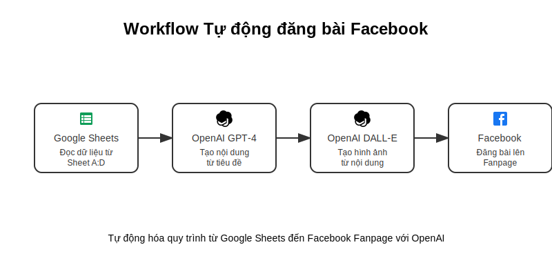

# n8n Auto Post Workflow

Workflow tự động đăng bài lên Facebook Fanpage sử dụng n8n

[](https://n8n-el0q.onrender.com/workflow/new?name=Auto%20Post%20Facebook&importUrl=https://raw.githubusercontent.com/insightfreedom247/n8n-auto-post-workflow/main/workflows/auto-post-workflow.json)

## Sơ đồ Workflow



## Mô tả

Dự án này tạo một workflow tự động hóa việc đăng bài lên Facebook Fanpage từ dữ liệu trong Google Sheets, sử dụng n8n làm nền tảng tự động hóa.

## Yêu cầu

- n8n server đang chạy
- Tài khoản Google với quyền truy cập Google Sheets
- Facebook Page và Facebook Developer App
- OpenAI API key (cho việc tạo nội dung)

## Cài đặt

1. Click vào nút "Sao chép Workflow" màu xanh ở trên để import workflow vào n8n server của bạn
2. Cấu hình các credentials:
   - Google Sheets
   - Facebook
   - OpenAI
3. Cập nhật các biến môi trường

## Biến môi trường

```env
SHEET_ID=your_google_sheet_id
FB_PAGE_ID=your_facebook_page_id
OPENAI_API_KEY=your_openai_api_key
```

## Sử dụng

1. Chuẩn bị Google Sheet với các cột:
   - Tiêu đề
   - Nội dung
   - Hình ảnh URL
   - Thời gian đăng

2. Kích hoạt workflow

3. Workflow sẽ:
   - Đọc dữ liệu từ Google Sheets
   - Tạo nội dung với OpenAI
   - Tạo hình ảnh với DALL-E
   - Đăng bài lên Facebook Fanpage

## Xử lý lỗi

- Kiểm tra logs trong n8n để debug
- Đảm bảo tất cả credentials còn hạn
- Xác nhận quyền truy cập vào Google Sheet và Facebook Page

## Đóng góp

Mọi đóng góp đều được chào đón! Hãy tạo pull request hoặc issue.

## License

MIT